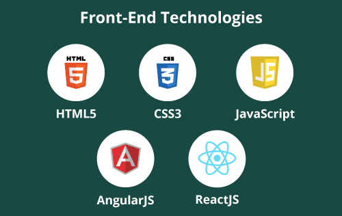

# Hello World

## Website development with:
### HTML5, Css3, Sass, Git, Java Script, react, Bootstrap 

## Albin Pirela
computer science student at Santiago Mariño University and some studies carried out in freecodecamp and udemy,
musician, professional stylist,
I am responsible, punctual, efficient and compliant. as a frontend developer I give my best effort
## Folow me
- GitHub: [@Albinpirela](https://github.com/Albinpirela)
- Twitter: [@AlbinPirela1](https://twitter.com/AlbinPirela1)
- LinkedIn: [albin pirela](https://www.linkedin.com/in/albin-pirela-21528a222/)
